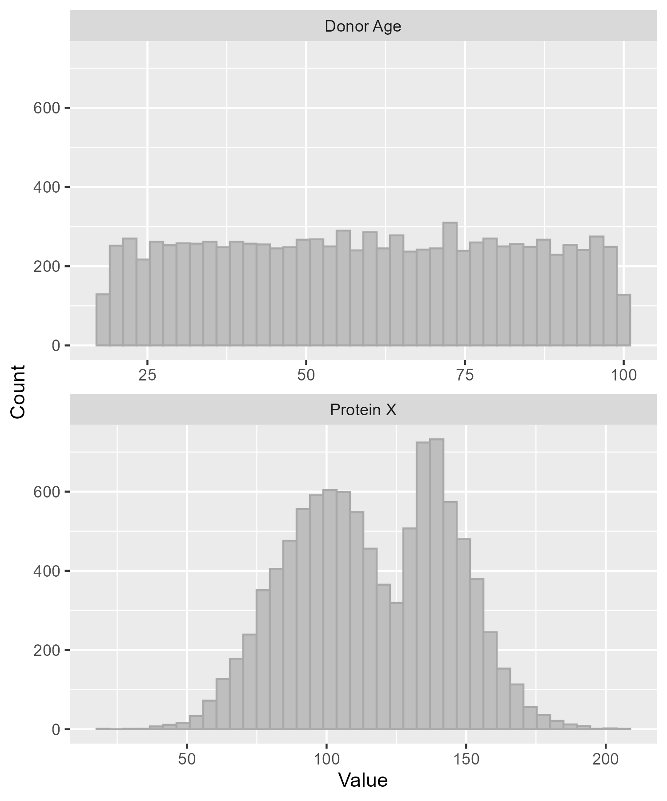

# distbuilder


[](https://app.codecov.io/gh/CamNZ/distbuilder)

`distbuilder` is an R package that builds sampler functions from distribution specifications.

It is intended for simulation workflows where distributions are defined in a structured format, such as a list or YAML file, then converted into functions that generate random values.

For supported distributions see:

```r
help("build_sampler", package = "distbuilder")
```

### Example workflow

Define distributions in YAML:

```yaml
# examples/params.yml
donor_age:
  distribution: uniform
  min: 18
  max: 100

protein_x:
  distribution: mixture
  components:
    - distribution: normal
      mean: 100
      sd: 20
      weight: 0.65
    - distribution: skew_normal
      location: 130
      scale: 20
      shape: 7
      weight: 0.35
```

Load parameters into R and generate data
```r
# Load parameters from YAML
params <- yaml::read_yaml("examples/params.yml")

# Create sampler functions
samplers <- lapply(params, distbuilder::build_sampler)

# Simulate data
sim_data <- data.frame(lapply(samplers, function(sampler) sampler(1e4)))
```



### Installation

Install from GitHub with `pak`:

```r
install.packages("pak")
pak::pak("CamNZ/distbuilder")
```

For a specific version:

```r
pak::pak("CamNZ/distbuilder@v0.2.0")
```


